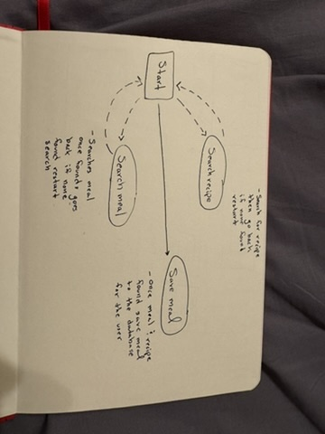
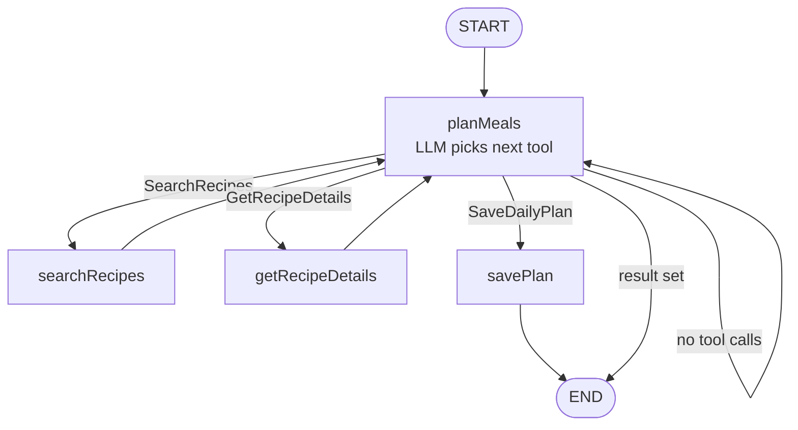
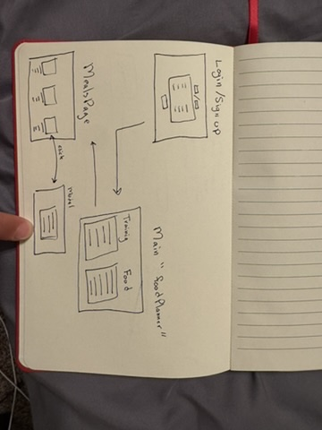

# NourishWeek

A meal planning app for triathletes. Enter your workouts and food preferences — an AI agent finds real recipes for breakfast, lunch, and dinner based on your calorie needs.

**Stack:** Express · MongoDB · LangGraph · Ollama · Spoonacular · Vue.js

---

## Resources

**User** — athlete account with biometrics. Calorie target auto-calculated via Mifflin-St Jeor on save.
`email, passwordHash, height, weight, age, sex, calorieTarget, heightFt, heightIn, weightLbs`

**DailyPlan** — one AI-generated meal plan per request, linked to a User.
`userId, date, totalCalories, workouts { swim, bike, run, lift }, meals [{ mealType, name, imageUrl, calories, macros, ingredients, instructions }]`

---

## API Endpoints

| Method | Path               | Description                        |
| ------ | ------------------ | ---------------------------------- |
| POST   | `/auth/register`   | Create account                     |
| POST   | `/auth/login`      | Login, receive JWT                 |
| POST   | `/users`           | Create user profile                |
| GET    | `/users/:id`       | Get user profile                   |
| POST   | `/daily-plans`     | Generate meal plan (auth required) |
| GET    | `/daily-plans/:id` | Fetch saved plan                   |

---

## Data Models

```js
// User
{ email, passwordHash, height, weight, age, sex, calorieTarget, heightFt, heightIn, weightLbs }

// DailyPlan
{ userId, date, totalCalories, workouts: { swim, bike, run, lift },
  meals: [{ mealType, name, imageUrl, calories, macros: { protein, carbs, fat }, ingredients, instructions }] }
```

---

## Agentic Workflow

Triggered by `POST /daily-plans`. The LangGraph agent calls the LLM repeatedly — each turn the LLM picks one tool to call until all 3 meals are found and saved.

**Tools:**

- `SearchRecipes { mealType, query }` — searches Spoonacular, falls back to simpler queries if 0 hits
- `GetRecipeDetails { mealType, recipeId }` — fetches ingredients, macros, instructions
- `SaveDailyPlan {}` — writes the 3 meals to MongoDB

### Agent Graph





---

## Wireframes


